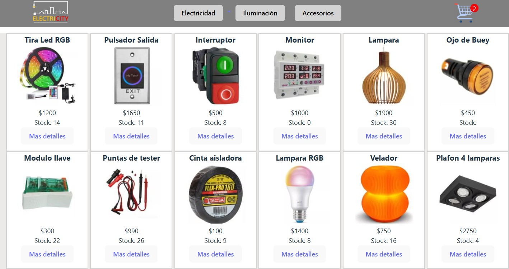
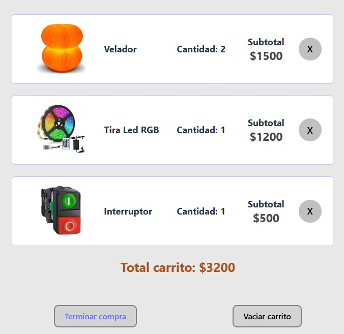
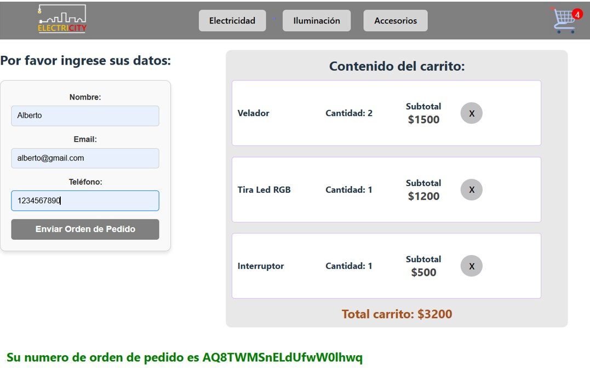

# Proyecto E-commerce utilizando React

`Tienda de productos eléctricos ELECTRI-CITY`

## Descripción

#### Se realizó como trabajo final para el curso de ReactJS de `Coderhouse`.
#### La tienda dispone de una serie de items alojados en una base de datos de `Firestore`. En la página home se muestran la totalidad de productos, los que pueden filtrarse por categorías y seleccionarse individualmente. Una vez seleccionado un producto, se puede indicar la cantidad (verificada en función al stock disponible) y agregarse una cantidad variable al carrito de compras.
#### En el carrito de compras se muestran los productos agregados, los que pueden eliminarse individualmente o en su totalidad y se dispone de un botón para avanzar hasta la última etapa de la compra, en donde se solicitan los datos personales. Al completarse los mismos se finaliza la transacción y se obtiene un id de compra que permite acceder al detalle almacenado en la base de datos.

## Tecnologias utilizadas 🛠️

- [React]
- [React-router-dom] 
- [React-loading] 
- [Firebase] 

## Descargar y correr el proyecto

### Instalación 🔧

Para descargar el proyecto desde el repositorio en formato zip_

1 - Ir a "Code" -> "Dowload Zip"

2 - Descomprimir el archivo

3 - En la carpeta donde se encuentra "package.json" ejecutar en una terminal:

### `npm install`

4 - Una vez finalizado, ejecutar:

### `npm run start`

Se abre una pestaña del navegador en el puerto 5173

Caso contrario copiar esta URL y pegarla en el navegador: `http://localhost:5173`

## Despliegue

El proyecto fue desplegado en Vercel para navegarlo.
XXXXXXXX XXXX

## Screenshots
### Home

### Categorías
 

### Carrito

### Checkout

## Autores
### Patricio Martínez - 2025